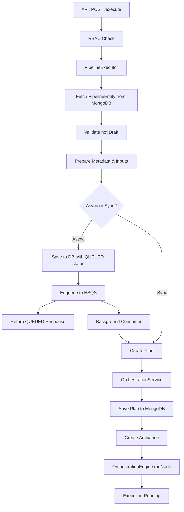

# Pipeline Execution Flow - Quick Reference

## Overview
Pipeline execution starts from a REST API call and flows through validation, plan creation, and orchestration layers before actual execution begins.

---

## API Entry Point

**Endpoint:** `POST /pipeline/execute/{identifier}`

**Interface:** `PlanExecutionResource.runPipelineWithInputSetPipelineYaml()`
- Location: `/pipeline-service/contracts/src/main/java/io/harness/pms/plan/execution/resources/PlanExecutionResource.java`

**Implementation:** `PlanExecutionResourceImpl.runPipelineWithInputSetPipelineYaml()`
- Location: `/pipeline-service/service/src/main/java/io/harness/pms/plan/execution/helper/PlanExecutionResourceImpl.java`
- Lines: 142-157

**Access Control:** Requires `PIPELINE_EXECUTE` permission via `@NGAccessControlCheck`

---

## Execution Flow Sequence

```
1. PlanExecutionResource (API Layer)
   ↓ [RBAC Check]

2. PipelineExecutor.runPipelineWithInputSetPipelineYaml()
   ↓ [Entry orchestration]

3. PipelineExecutor.startPlanExecution() [Multiple overloads]
   ↓ [Fetch pipeline, validate, prepare args]

4. ExecutionHelper.fetchPipelineEntity()
   ↓ [MongoDB query for pipeline YAML]

5. ExecutionHelper.getPipelineMetadataInternalDTO()
   ↓ [Resolve templates, merge inputs]

6. ExecutionHelper.startExecution()
   ↓ [Route to async/sync path]

7A. ASYNC PATH: PlanCreationQueueRequestHelper.savePlanExecutionAndQueuePlanExecutionRequest()
    ↓ [Save to DB, enqueue to HSQS]
    → Background: processMessage() → executePlanCreationRequest()

7B. SYNC PATH: PlanCreationQueueRequestHelper.executePlanCreationRequest()
    ↓ [Direct plan creation]

8. PlanCreationQueueRequestHelper.createPlan()
   ↓ [Convert YAML to executable DAG]

9. OrchestrationServiceImpl.startExecution()
   ↓ [Save plan, build ambiance]

10. OrchestrationEngine.runNode()
    → [Begin actual pipeline execution]
```

---

## Key Classes and Their Roles

| Class | Location | Key Method | Purpose |
|-------|----------|------------|---------|
| **PlanExecutionResource** | contracts/.../resources/ | runPipelineWithInputSetPipelineYaml() | API contract |
| **PlanExecutionResourceImpl** | service/.../helper/ | runPipelineWithInputSetPipelineYaml() | API implementation, RBAC |
| **PipelineExecutor** | service/.../helper/ | startPlanExecution() | Main orchestrator |
| **ExecutionHelper** | service/.../helper/ | startExecution() | Pipeline fetch, metadata prep |
| **PlanCreationQueueRequestHelper** | service/.../helper/ | savePlanExecutionAndQueuePlanExecutionRequest() | Async/sync routing, plan creation |
| **OrchestrationServiceImpl** | modules/orchestration/.../impl/ | startExecution() | Orchestration entry |
| **OrchestrationEngine** | modules/orchestration/ | runNode() | Actual execution |

---

## Data Flow

### Input → Processing → Execution

1. **API Request:**
   - accountId, orgId, projectId, pipelineId
   - inputSetPipelineYaml (runtime inputs)
   - asyncPlanCreation flag

2. **Pipeline Entity Fetch:**
   - MongoDB `pipelines` collection
   - Returns: Pipeline YAML, metadata, git info

3. **Metadata Preparation:**
   - Template resolution
   - Input merging
   - ExecutionMetadata creation (trigger info, principal, UUID)

4. **Plan Creation:**
   - YAML → DAG (Plan object)
   - Nodes: Pipeline → Stages → Steps
   - Dependencies graph

5. **Execution Start:**
   - Ambiance creation (execution context)
   - State machine initialization
   - Event publishing

---

## MongoDB Collections

| Collection | Purpose | When Written |
|------------|---------|--------------|
| `pipelines` | Pipeline definitions | Pre-existing (read only) |
| `planExecutions` | Execution records | Step 7 (async) or 9 (sync) |
| `planExecutionMetadata` | Execution metadata | Step 7 (async) or 9 (sync) |
| `planCreationQueueRequests` | Queue requests | Step 7A (async only) |
| `plans` | Execution DAG | Step 9 |
| `pipelineExecutionSummary` | UI summary | Step 9 |

---

## Async vs Sync Execution

### Async (Queue-Based)
**When:** Complex pipelines, feature flag enabled, or explicit request
**Flow:**
1. Create PlanExecution (status: `QUEUED_PLAN_CREATION`)
2. Save to MongoDB
3. Enqueue to HSQS (message queue)
4. Return immediately
5. Background consumer processes queue → creates plan → starts execution

**Benefits:** No API timeout, better concurrency control

### Sync (Direct)
**When:** Simple pipelines, default mode
**Flow:**
1. Create plan directly
2. Start execution immediately
3. Return after orchestration starts

**Benefits:** Faster for simple cases

---

## Key Decision Points

### 1. Draft Check (Line 326-329, 350-354 in PipelineExecutor)
- **If Draft:** Throw InvalidRequestException
- **If Not Draft:** Continue

### 2. Async vs Sync (ExecutionHelper.startExecution line 1036-1072)
- **Check:**
  - Feature flag: `PIPE_ENABLE_QUEUE_BASED_PLAN_CREATION`
  - Trigger type
  - Explicit asyncPlanCreation parameter
- **Route:** Queue-based OR Direct

### 3. Input Handling (PipelineExecutor line 355-365)
- **If Rerun with fixedInputsOnRerun:** Use original inputs
- **Else:** Use provided runtime inputs

---

## Execution States

```
QUEUED_PLAN_CREATION → STARTING_PLAN_CREATION → RUNNING → SUCCESS/FAILURE/ABORTED
```

---

## Important Concepts

### Ambiance
Protobuf message containing execution context:
- Plan execution ID
- Setup abstractions (account/org/project)
- Execution metadata
- Expression functor token

Propagated through entire execution.

### ExecArgs
Container for execution parameters:
- Runtime inputs (JsonNode)
- Stages to run
- Module type
- Notes, flags, scope info

### Plan
DAG representation of pipeline:
- Nodes: Map<nodeId, PlanNode>
- Dependencies: Graph structure
- Entry point: startingNodeId

---

## Technology Stack

- **REST:** Dropwizard/Jersey
- **DI:** Guice
- **DB:** MongoDB (Morphia ORM)
- **Queue:** HSQS (Redis/Kafka based)
- **Serialization:** Jackson (YAML/JSON), Protobuf (Ambiance)

---

## Quick Debug Guide

### Trace an Execution
1. Get execution ID from API response
2. MongoDB query:
   ```
   db.planExecutions.findOne({_id: "exec_id"})
   db.planExecutionMetadata.findOne({planExecutionId: "exec_id"})
   ```
3. Search logs for `[PMS_EXECUTE]` or execution ID

### Common Issues
- **Stuck QUEUED:** Check queue consumer, concurrency limits
- **Access Denied:** RBAC issue
- **Template Error:** Template resolution failed
- **Draft Error:** Trying to execute draft pipeline

---

## File Paths (Absolute)

```
/Users/sahilhindwani/projects/harness-core/pipeline-service/
├── contracts/src/main/java/io/harness/pms/plan/execution/resources/
│   └── PlanExecutionResource.java (API contract)
├── service/src/main/java/io/harness/pms/plan/execution/helper/
│   ├── PlanExecutionResourceImpl.java (API impl)
│   ├── PipelineExecutor.java (Main orchestrator)
│   ├── ExecutionHelper.java (Helper utilities)
│   └── PlanCreationQueueRequestHelper.java (Queue/Plan creation)
└── modules/orchestration/src/main/java/io/harness/engine/
    └── impl/OrchestrationServiceImpl.java (Orchestration service)
```

---

## Mermaid Flow Diagram



---

## Summary

**Entry:** REST API → RBAC → PipelineExecutor
**Processing:** Fetch pipeline → Validate → Merge inputs → Prepare metadata
**Routing:** Async (queue) OR Sync (direct)
**Plan Creation:** YAML → DAG
**Execution:** Orchestration engine starts execution

This flow ensures proper validation, governance, and scalability for pipeline executions.
