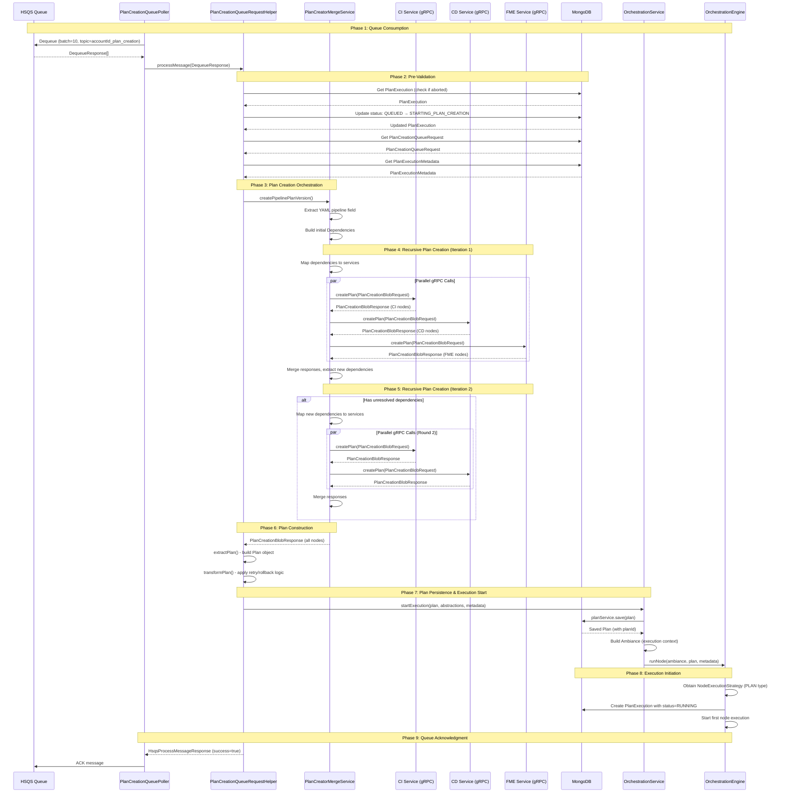

# Pipeline Plan Creation Flow Analysis

## Executive Summary

This document traces the complete flow of plan creation in the Harness Pipeline Service, from when a plan creation request is queued through YAML-to-DAG conversion, gRPC interactions with SDK services, plan persistence, and execution initiation. The plan creation phase is the critical bridge between a pipeline YAML definition and its executable representation as a directed acyclic graph (DAG) of nodes.

## Table of Contents

1. [Entry Point: Queue Message Consumption](#entry-point-queue-message-consumption)
2. [Plan Creation Orchestration](#plan-creation-orchestration)
3. [gRPC-Based Plan Creation](#grpc-based-plan-creation)
4. [YAML to Plan Conversion](#yaml-to-plan-conversion)
5. [Plan Node Graph Building](#plan-node-graph-building)
6. [Plan Persistence](#plan-persistence)
7. [Execution Initiation](#execution-initiation)
8. [Complete Flow Diagram](#complete-flow-diagram)
9. [Key Data Structures](#key-data-structures)

---

## Entry Point: Queue Message Consumption

### 1.1 Queue Polling Setup

**File**: `/Users/sahilhindwani/projects/harness-core/pipeline-service/service/src/main/java/io/harness/pms/plan/execution/queue/PlanCreationQueuePoller.java`

The plan creation process begins with a dedicated poller that continuously monitors a queue for plan creation requests.

**Key Class**: `PlanCreationQueuePoller` (implements `io.dropwizard.lifecycle.Managed`)

**Lifecycle**:
- **start()** (Line 31-35): Spawns a single-threaded executor named `{moduleName}-queue-poller`
- **run()** (Line 36-52): Continuous loop that calls `planCreationPollerUtils.readEventsFrameworkMessages()`
- Respects maintenance mode by sleeping when `MaintenanceController.getMaintenanceFlag()` is true

### 1.2 Message Dequeuing

**File**: `/Users/sahilhindwani/projects/harness-core/pipeline-service/service/src/main/java/io/harness/pms/plan/execution/queue/PlanCreationPollerUtils.java`

**Key Method**: `pollAndProcessMessages()` (Line 63-78)

**Queue Technology**: HSQS (Harness Simple Queue Service)

**Dequeue Configuration**:
- **Topic**: `{accountId}_plan_creation`
- **Consumer Name**: Same as topic
- **Batch Size**: Configurable via `planCreationHsqsDequeueConfig` (default: 10)
- **Max Wait Duration**: 5 seconds

```java
List<DequeueResponse> messages = hsqsClientService.dequeue(
    DequeueRequest.builder()
        .batchSize(getBatchSize())
        .consumerName(this.getModuleName())
        .topic(this.getModuleName())
        .maxWaitDuration(5)
        .build()
);
```

**Processing Strategy**:
- Messages are processed in parallel using `planCreationExecutorService`
- Each message is handed to `processMessage()` for individual processing
- Sleep logic: If messages < batch size, sleep for configured duration (prevents busy-waiting)

### 1.3 Message Processing

**File**: `/Users/sahilhindwani/projects/harness-core/pipeline-service/service/src/main/java/io/harness/pms/plan/execution/queue/PlanCreationPollerUtils.java`

**Method**: `processMessage(DequeueResponse message)` (Line 80-84)

Delegates to `PlanCreationQueueRequestHelper.processMessage()` and handles ACK/UNACK based on result.

---

## Plan Creation Orchestration

### 2.1 Queue Message Payload Structure

**File**: `/Users/sahilhindwani/projects/harness-core/pipeline-service/service/src/main/java/io/harness/pms/plan/execution/helper/PlanCreationQueuePayload.java`

**Payload Fields**:
- `planExecutionId`: UUID of the execution
- `accountId`: Account identifier
- `priorityType`: HIGH, NORMAL, or LOW priority

### 2.2 Message Processing Entry Point

**File**: `/Users/sahilhindwani/projects/harness-core/pipeline-service/service/src/main/java/io/harness/pms/plan/execution/helper/PlanCreationQueueRequestHelper.java`

**Method**: `processMessage(DequeueResponse message)` (Line 310-368)

**Processing Steps**:

1. **Deserialize Payload** (Line 315-316):
   ```java
   PlanCreationQueuePayload planCreationQueuePayload =
       RecastOrchestrationUtils.fromJson(message.getPayload(), PlanCreationQueuePayload.class);
   ```

2. **Check if Already Aborted** (Line 322-324):
   - Queries `PlanExecution` to see if status is already final
   - If final, returns success (no need to reprocess)

3. **Check Concurrency Limits** (Line 326-328):
   - Calls `pipelineSettingsService.shouldQueuePlanExecution(accountId, priorityType)`
   - If limit reached, returns `success=false` to requeue the message

4. **Update Status to STARTING_PLAN_CREATION** (Line 332-337):
   - Atomically updates `PlanExecution` status from `QUEUED_PLAN_CREATION` to `STARTING_PLAN_CREATION`
   - This prevents duplicate processing (idempotency guarantee)
   - If update fails (already processed), returns `success=false`

5. **Retrieve Plan Creation Context** (Line 344-351):
   - Fetches `PlanCreationQueueRequest` from MongoDB
   - Fetches `PlanExecutionMetadata` from MongoDB
   - Builds `PlanExecutionMetadataWithContext` combining both

6. **Execute Plan Creation** (Line 352-353):
   ```java
   executePlanCreationRequest(createPlanCreationRequest(
       accountId, planCreationQueueRequest, updatedPlanExecution, planExecutionMetadataWithContext));
   ```

7. **Handle Expiration** (Line 345-347):
   - If `PlanCreationQueueRequest` is null (TTL expired), marks execution as `EXPIRED`

8. **Update TTL** (Line 358):
   - Extends TTL of `PlanCreationQueueRequest` after successful processing

### 2.3 Plan Creation Execution

**Method**: `executePlanCreationRequest(PlanCreationRequest planCreationRequest)` (Line 499-563)

**Key Operations**:

1. **Setup Abstractions** (Line 511):
   ```java
   Map<String, String> abstractions = setupAbstractions(accountId, orgIdentifier, projectIdentifier, scopeInfo);
   ```
   - Adds `accountId`, `projectIdentifier`, `orgIdentifier`, `parentUniqueId`

2. **Create Plan** (Line 522-523):
   ```java
   Plan plan = createPlan(accountId, orgIdentifier, projectIdentifier, executionMetadata,
       planExecutionMetadataWithContext, scopeInfo, isParentIdQueryingEnabled, startTs, abstractions);
   ```

3. **Fetch Step Modules** (Line 527):
   - Calls `nodeTypeLookupService.modulesThatSupportStepTypes(planNodesList)`
   - Returns list of modules (e.g., ["CD", "CI", "FME"]) based on step types in plan

4. **Transform Plan for Retry/Rollback** (Line 539-543):
   - If retry: calls `retryExecutionHelper.transformPlan()`
   - If rollback mode: calls `rollbackModeExecutionHelper.transformPlanForRollbackMode()`

5. **Start Execution** (Line 553-554):
   ```java
   return orchestrationService.startExecution(
       plan, abstractions, finalExecutionMetadata, planExecutionMetadataWithContext);
   ```

---

## gRPC-Based Plan Creation

### 3.1 Plan Creation Service Discovery

**File**: `/Users/sahilhindwani/projects/harness-core/pipeline-service/service/src/main/java/io/harness/pms/sdk/helper/PmsSdkHelper.java`

**Method**: `getServicesV2(String accountId)` (Line 88-101)

**Service Registration**:
- Services register themselves via `PmsSdkInstance` MongoDB collection
- Each service provides:
  - **ModuleType**: CI, CD, CV, STO, etc.
  - **Supported Types**: Map of YAML paths to supported step/stage types
  - **gRPC Client Stub**: `PlanCreationServiceGrpc.PlanCreationServiceBlockingStub`

**Priority-Based Routing** (if `CDS_PIPELINE_SDK_PRIORITY` FF enabled):
- Services are sorted by priority from `pipelineSdkPriority` config
- Lower number = higher priority

### 3.2 Plan Creation Entry Point

**File**: `/Users/sahilhindwani/projects/harness-core/pipeline-service/service/src/main/java/io/harness/pms/plan/execution/helper/PlanCreatorMergeService.java`

**Method**: `createPipelinePlanVersion()` (Line 135-145)

Extracts pipeline field from YAML and delegates to `createPlanVersioned()`.

### 3.3 Plan Creation Orchestration

**Method**: `createPlanVersioned()` (Line 147-220)

**Steps**:

1. **OPA Stage Injection** (Line 158-183) (if `OPA_RUN_ON_CUSTOMER_INFRA` FF enabled):
   - Uses `PlanCreationYamlPreprocessorV0` to inject OPA evaluation stage
   - Modifies YAML before plan creation

2. **Build Initial Dependencies** (Line 197-203):
   ```java
   Dependencies dependencies = Dependencies.newBuilder()
       .setYaml(planExecutionMetadataWithContext.getProcessedYaml())
       .putDependencies(rootField.getNode().getUuid(), rootField.getNode().getYamlPath())
       .putDependencyMetadata(rootField.getNode().getUuid(),
           Dependency.newBuilder().setParentInfo(parentInfoBuilder.build()).build())
       .build();
   ```

3. **Create Initial Plan Creation Context** (Line 223-264):
   - **Timeout Settings**: Fetched from `NGSettingsClient`
   - **Feature Flags**: Builds map of relevant FFs for plan creation
   - **Trigger Payload**: From `PlanExecutionMetadata`
   - **Scope Info**: Account/org/project identifiers

4. **Recursive Plan Creation** (Line 206-212):
   ```java
   if (pmsFeatureFlagHelper.isEnabled(accountId, FeatureName.CDS_CREATE_MERGE_PLAN_V2_OPTIMIZED_FLOW)) {
       finalResponse = createPlanForDependenciesRecursiveV2(...);
   } else {
       finalResponse = createPlanForDependenciesRecursive(...);
   }
   ```

### 3.4 Recursive Dependency Resolution

**Method**: `createPlanForDependenciesRecursive()` (Line 347-384)

**Algorithm**:

```
MAX_DEPTH = 10
finalResponseBuilder = PlanCreationBlobResponse.builder()

for i in 0 to MAX_DEPTH:
    if no dependencies left:
        break

    currIterationResponse = createPlanForDependencies(services, finalResponseBuilder, fullYamlField, version, accountId)

    merge nodes from currIterationResponse
    merge layoutInfo, serviceAffinity, context

    if still has unresolved dependencies after MAX_DEPTH:
        throw InvalidRequestException
```

**Why Recursive?**
- Plan creation happens in layers: Pipeline → Stages → Steps → Sub-steps
- Each layer may introduce new dependencies
- Maximum 10 iterations to prevent infinite loops

### 3.5 Single Iteration Plan Creation

**Method**: `createPlanForDependencies()` (Line 420-474)

**Steps**:

1. **Map Dependencies to Services** (Line 434-437):
   ```java
   Map<Map.Entry<String, PlanCreatorServiceInfo>, List<Map.Entry<String, String>>> serviceToDependencyMap = new HashMap<>();
   getServiceToDependenciesMap(services, responseBuilder, fullYamlField, serviceToDependencyMap, harnessVersion, accountId);
   ```

   **Service Selection Priority** (Line 579-626):
   - First: Check affinity service (if explicitly set)
   - Second: Pipeline service (pipeline-service itself)
   - Third: Other services (CD, CI, etc.)

2. **Batch Dependencies** (Line 440):
   - Groups dependencies into batches (default size: from config)
   - Prevents overwhelming services with too many dependencies at once

3. **Execute gRPC Calls in Parallel** (Line 442-470):
   ```java
   CompletableFutures<PlanCreationResponseWithModule> completableFutures = new CompletableFutures<>(executor);
   executeCreatePlanInBatchDependency(responseBuilder, completableFutures, serviceToDependencyMap);
   List<PlanCreationResponseWithModule> planCreationResponses = completableFutures.allOf().get(5, TimeUnit.MINUTES);
   ```

   **Timeout**: 5 minutes for all gRPC calls to complete

### 3.6 gRPC Plan Creation Request

**Proto File**: `/Users/sahilhindwani/projects/harness-core/pipeline-service/modules/pms-contracts/src/main/proto/io/harness/pms/contracts/plan/plan_creation_service.proto`

**Service Definition** (Line 21-25):
```protobuf
service PlanCreationService {
  rpc createPlan(PlanCreationBlobRequest) returns (PlanCreationResponse);
  rpc createFilter(FilterCreationBlobRequest) returns (FilterCreationResponse);
  rpc createVariablesYaml(VariablesCreationBlobRequest) returns (VariablesCreationResponse);
}
```

**Request Structure** (Line 27-32):
```protobuf
message PlanCreationBlobRequest {
  map<string, PlanCreationContextValue> context = 4;
  Dependencies deps = 5;
  map<string, string> serviceAffinity = 6;
}
```

**Dependencies Structure** (Line 181-186):
```protobuf
message Dependencies {
  string yaml = 1;                              // Full YAML
  map<string, string> dependencies = 2;         // UUID -> YAML path
  map<string, Dependency> dependencyMetadata = 3; // UUID -> metadata
}
```

**Response Structure** (Line 34-39):
```protobuf
message PlanCreationResponse {
  oneof response {
    ErrorResponse errorResponse = 1;
    PlanCreationBlobResponse blobResponse = 2;
  }
}
```

**PlanCreationBlobResponse** (Line 41-51):
```protobuf
message PlanCreationBlobResponse {
  map<string, PlanNodeProto> nodes = 1;           // Created plan nodes
  string startingNodeId = 3;                      // Entry point
  map<string, PlanCreationContextValue> context = 4; // Updated context
  GraphLayoutInfo graphLayoutInfo = 5;            // UI layout
  Dependencies deps = 6;                          // Unresolved dependencies
  repeated string preservedNodesInRollbackMode = 8;
  map<string, string> serviceAffinity = 9;        // Node -> Service mapping
}
```

### 3.7 gRPC Call Execution

**File**: `/Users/sahilhindwani/projects/harness-core/pipeline-service/service/src/main/java/io/harness/pms/plan/execution/helper/PlanCreatorMergeService.java`

**Method**: `executeDependenciesAsync()` (Line 629-662)

**Async Execution**:
```java
completableFutures.supplyAsyncExecutorsMap(serviceInfo.getKey(), () -> {
    return PlanCreationResponseWithModule.builder()
        .planCreationResponse(PmsGrpcClientUtils.retryAndProcessException(
            serviceInfo.getValue().getPlanCreationClient()::createPlan,
            PlanCreationBlobRequest.newBuilder()
                .setDeps(batchDependency)
                .putAllContext(contextMap)
                .putAllServiceAffinity(batchServiceAffinityMap)
                .build()))
        .module(serviceInfo.getKey())
        .build();
});
```

**Error Handling**:
- Catches `StatusRuntimeException` (gRPC connection errors)
- Returns `ErrorResponse` with service name
- Does not fail entire plan creation if one service fails

---

## YAML to Plan Conversion

### 4.1 YAML Parsing

**File**: `/Users/sahilhindwani/projects/harness-core/pipeline-service/service/src/main/java/io/harness/pms/yaml/YamlUtils.java`

**Key Methods**:
- `extractPipelineField(String yaml)`: Extracts root pipeline field
- `readTree(String yaml)`: Parses YAML into `YamlField` tree structure

**YamlField Structure**:
- **name**: Field name (e.g., "pipeline", "stages", "steps")
- **uuid**: Unique identifier (auto-generated during parsing)
- **yamlPath**: Path from root (e.g., "pipeline.stages[0].stage")
- **node**: Contains actual YAML value and child fields

### 4.2 Plan Node Creation (Service Side)

Plan creators are implemented in individual services (CI, CD, FME, etc.). They receive dependencies and return plan nodes.

**Example**: FME Flag Create Step

**File**: `/Users/sahilhindwani/projects/harness-core/pipeline-service/modules/orchestration-steps/src/main/java/io/harness/plancreator/steps/internal/FmeFlagCreatePlanCreator.java`

**Interface**: `PartialPlanCreator<YamlField>`

**Key Methods**:
1. **getSupportedTypes()**: Returns map of supported YAML fields
2. **createPlanForField()**: Converts YAML field to plan nodes

**Plan Node Components**:
- **uuid**: Unique identifier
- **name**: Display name
- **identifier**: User-defined identifier
- **stepType**: Type of step (e.g., "FmeFlagCreate")
- **stepParameters**: Serialized step configuration
- **facilitatorObtainments**: How to obtain facilitator (SYNC/ASYNC)
- **adviserObtainments**: Failure strategy, rollback logic
- **skipGraphType**: When/conditional execution
- **skipExpressionChain**: Expression evaluation control

### 4.3 Plan Node Proto Conversion

**File**: `/Users/sahilhindwani/projects/harness-core/pipeline-service/modules/orchestration-beans/src/main/java/io/harness/plan/PlanNode.java`

**Method**: `fromPlanNodeProto(PlanNodeProto proto, String accountId)`

Converts protobuf `PlanNodeProto` to Java `PlanNode` object.

---

## Plan Node Graph Building

### 5.1 Dependency Graph Structure

**Representation**: Each plan node contains:
- **Next nodes**: List of node IDs to execute after this node completes
- **Children nodes**: Nested nodes (for parallel/strategy execution)
- **Conditional logic**: `skipCondition` determines if node should execute

**Graph Types**:
1. **Sequential**: Node A → Node B → Node C
2. **Parallel**: Node A → [Node B, Node C, Node D] (all execute simultaneously)
3. **Conditional**: Node A → (condition ? Node B : Node C)
4. **Looped**: Strategy nodes that spawn multiple children

### 5.2 Starting Node Resolution

**File**: `/Users/sahilhindwani/projects/harness-core/pipeline-service/service/src/main/java/io/harness/pms/plan/execution/helper/PlanCreatorMergeService.java`

**Merging Logic** (Line 367-368):
```java
PlanCreationBlobResponseUtils.mergeStartingNodeId(finalResponseBuilder, currIterationResponse.getStartingNodeId());
```

The `startingNodeId` is typically the first stage or the pipeline setup node.

### 5.3 Layout Information

**GraphLayoutInfo** contains UI layout metadata:
- **layoutNodes**: Map of node UUID → `GraphLayoutNode`
- **GraphLayoutNode** fields:
  - `nodeType`: "stage", "step", "stepGroup", etc.
  - `nodeIdentifier`: User-defined identifier
  - `name`: Display name
  - `nodeUuid`: Plan node UUID
  - `edgeLayoutList`: Edges to next nodes for UI rendering

---

## Plan Persistence

### 6.1 Plan Construction

**File**: `/Users/sahilhindwani/projects/harness-core/pipeline-service/service/src/main/java/io/harness/pms/plan/execution/PlanExecutionUtils.java`

**Method**: `extractPlan(PlanCreationBlobResponse planCreationBlobResponse, String accountId)` (Line 30-34)

**Build Process** (Line 42-56):
```java
PlanBuilder planBuilder = Plan.builder();
planBuilder.accountIdentifier(accountId);

// Add all plan nodes
for (PlanNodeProto planNodeProto : planCreationBlobResponse.getNodesMap().values()) {
    planBuilder.planNode(PlanNode.fromPlanNodeProto(planNodeProto, accountId));
}

// Set starting node
if (isNotEmpty(planCreationBlobResponse.getStartingNodeId())) {
    planBuilder.startingNodeId(planCreationBlobResponse.getStartingNodeId());
}

// Add layout info
if (planCreationBlobResponse.hasGraphLayoutInfo()) {
    planBuilder.graphLayoutInfo(planCreationBlobResponse.getGraphLayoutInfo());
}

return planBuilder.build();
```

### 6.2 Plan Model

**File**: `/Users/sahilhindwani/projects/harness-core/pipeline-service/modules/orchestration-beans/src/main/java/io/harness/plan/Plan.java`

**MongoDB Collection**: `plans` (database: `pms`)

**Key Fields**:
- `uuid`: Plan ID (auto-generated)
- `planNodes`: List of executable nodes
- `startingNodeId`: Entry point for execution
- `stepModules`: Modules involved (CD, CI, etc.)
- `graphLayoutInfo`: UI layout metadata
- `accountIdentifier`: Account ID
- `validUntil`: TTL index (3 months)

**Indexes**:
- `accountIdentifier`: FdIndex for querying by account
- `validUntil`: FdTtlIndex for automatic cleanup

### 6.3 Plan Saving

**File**: `/Users/sahilhindwani/projects/harness-core/pipeline-service/modules/orchestration/src/main/java/io/harness/engine/impl/OrchestrationServiceImpl.java`

**Method**: `startExecution()` (Line 47-54)

```java
long start = System.currentTimeMillis();
Plan savedPlan = planService.save(plan);
log.info("[PMS_EXECUTE] PlanService plan save time {}ms", System.currentTimeMillis() - start);
return executePlan(savedPlan, setupAbstractions, metadata, planExecutionMetadataWithContext);
```

**PlanService Implementation**:
- Uses Spring Data MongoDB repository
- Saves entire plan as single document
- Returns saved plan with MongoDB-assigned version

---

## Execution Initiation

### 7.1 Ambiance Construction

**File**: `/Users/sahilhindwani/projects/harness-core/pipeline-service/modules/orchestration/src/main/java/io/harness/engine/impl/OrchestrationServiceImpl.java`

**Method**: `executePlan()` (Line 62-83)

**Ambiance** is the execution context that flows through the entire pipeline execution:

```java
Ambiance ambiance = Ambiance.newBuilder()
    .putAllSetupAbstractions(setupAbstractions)      // Account, org, project
    .setPlanExecutionId(metadata.getExecutionUuid()) // Execution ID
    .setPlanId(plan.getUuid())                       // Plan ID
    .setMetadata(metadata)                           // Execution metadata
    .setExpressionFunctorToken(expressionFunctorToken) // For expression evaluation
    .setStartTs(System.currentTimeMillis())          // Start timestamp
    .build();
```

### 7.2 Orchestration Engine Invocation

**Method**: `orchestrationEngine.runNode(ambiance, plan, planExecutionMetadataWithContext)` (Line 82)

**File**: `/Users/sahilhindwani/projects/harness-core/pipeline-service/modules/orchestration/src/main/java/io/harness/engine/impl/OrchestrationEngineImpl.java`

**Method**: `runNode()` (Line 64-68)

**Strategy Pattern**:
```java
NodeExecutionStrategy strategy = strategyFactory.obtainStrategy(node.getNodeType());
return (T) strategy.runNode(ambiance, node, metadata);
```

**Node Types**:
- `PLAN`: Top-level plan node
- `STAGE`: Pipeline stage
- `STEP`: Individual step
- `STEP_GROUP`: Group of steps
- `FORK`: Parallel execution
- etc.

### 7.3 Plan Execution Status Update

**Status Transitions**:
1. `QUEUED_PLAN_CREATION` → (queue pickup)
2. `STARTING_PLAN_CREATION` → (plan creation begins)
3. (Plan creation completes)
4. Status updated to `RUNNING` when first node starts

**Database Update**:
- `PlanExecution` document updated with:
  - `status`: RUNNING
  - `planId`: Reference to saved plan
  - Execution start logged via observers

---

## Complete Flow Diagram



---

## Key Data Structures

### PlanCreationQueueRequest

**MongoDB Collection**: `planCreationQueueRequests`

**Purpose**: Persists plan creation request details for async processing

**Fields**:
- `planExecutionId`: Execution UUID
- `accountId`, `orgId`, `projectId`: Scope
- `pipelineYamlWithTemplateRef`: YAML with template refs (unexpanded)
- `isRetry`, `retryStagesIdentifier`: Retry execution metadata
- `identifierOfSkipStages`: Stages to skip
- `isDynamicExecution`: Dynamic child pipeline flag
- `validUntil`: TTL (1 month)

**File**: `/Users/sahilhindwani/projects/harness-core/pipeline-service/modules/orchestration-beans/contracts/src/main/java/io/harness/execution/PlanCreationQueueRequest.java`

### Plan

**MongoDB Collection**: `plans`

**Purpose**: Executable DAG representation of pipeline

**Fields**:
- `uuid`: Plan ID
- `planNodes`: List of `PlanNode` objects
- `startingNodeId`: Entry point node ID
- `graphLayoutInfo`: UI layout metadata
- `stepModules`: Modules involved (CD, CI, FME)
- `preservedNodesInRollbackMode`: Rollback-specific nodes
- `validUntil`: TTL (3 months)

**File**: `/Users/sahilhindwani/projects/harness-core/pipeline-service/modules/orchestration-beans/src/main/java/io/harness/plan/Plan.java`

### PlanNode

**Purpose**: Single executable unit in the plan DAG

**Key Fields**:
- `uuid`: Node ID
- `identifier`: User-defined identifier
- `name`: Display name
- `stepType`: Step type (e.g., "FmeFlagCreate", "Http", "ShellScript")
- `stepParameters`: Serialized step configuration (Kryo)
- `facilitatorObtainments`: How step execution is facilitated
- `adviserObtainments`: Failure strategies, rollback advisers
- `refObjects`: Referenced entities (secrets, connectors)
- `skipGraphType`: NOOP or conditional execution

**File**: `/Users/sahilhindwani/projects/harness-core/pipeline-service/modules/orchestration-beans/src/main/java/io/harness/plan/PlanNode.java`

### Dependencies (Protobuf)

**Purpose**: Tracks unresolved YAML paths during plan creation

**Fields**:
- `yaml`: Full pipeline YAML
- `dependencies`: Map of UUID → YAML path (e.g., "pipeline.stages[0].stage")
- `dependencyMetadata`: Metadata for each dependency (parent context, rollback behavior)

**Proto File**: `/Users/sahilhindwani/projects/harness-core/pipeline-service/modules/pms-contracts/src/main/proto/io/harness/pms/contracts/plan/plan_creation_service.proto` (Line 181-186)

### Ambiance

**Purpose**: Execution context that flows through all nodes

**Key Fields**:
- `planExecutionId`: Execution UUID
- `planId`: Plan UUID
- `metadata`: `ExecutionMetadata` (pipeline ID, trigger info, run sequence)
- `setupAbstractions`: Account, org, project, scope
- `levels`: Execution hierarchy (pipeline → stage → step)
- `expressionFunctorToken`: Token for expression evaluation

**Proto File**: `io/harness/pms/contracts/ambiance.proto`

---

## Key Metrics and Timings

### Plan Creation Time Metric

**Metric Name**: `plan_creation_time`

**Logged At**: `/Users/sahilhindwani/projects/harness-core/pipeline-service/service/src/main/java/io/harness/pms/plan/execution/helper/PlanCreationQueueRequestHelper.java` (Line 686-694)

**Tags**:
- `status`: SUCCESS or FAILED
- `module`: Module that failed (if applicable)
- `accountId`, `orgIdentifier`, `projectIdentifier`

**Typical Timings**:
- Simple pipeline: 500ms - 2s
- Complex pipeline with templates: 2s - 10s
- Very large pipeline: 10s - 30s

### Plan Save Time

**Logged At**: `/Users/sahilhindwani/projects/harness-core/pipeline-service/modules/orchestration/src/main/java/io/harness/engine/impl/OrchestrationServiceImpl.java` (Line 52)

**Log**: `[PMS_EXECUTE] PlanService plan save time {}ms`

**Typical Timing**: 50ms - 500ms (depends on plan size)

---

## Error Handling

### Plan Creation Errors

1. **Service Unavailable** (Line 646-658 in `PlanCreatorMergeService.java`):
   - gRPC `StatusRuntimeException` caught
   - Returns `ErrorResponse` with service name
   - Error bubbled up to caller

2. **Unresolved Dependencies** (Line 373-375 in `PlanCreatorMergeService.java`):
   - After MAX_DEPTH iterations, if dependencies remain
   - Throws `InvalidRequestException` with unresolved paths

3. **Invalid YAML** (Line 590-593 in `PlanCreationQueueRequestHelper.java`):
   - Throws `InvalidYamlException` with node FQN

4. **Expired Execution** (Line 370-392 in `PlanCreationQueueRequestHelper.java`):
   - If `PlanCreationQueueRequest` TTL expired
   - Marks `PlanExecution` as `EXPIRED`

### Retry Logic

**Queue-Level Retry**:
- If `processMessage()` returns `success=false`, message is UNACK'd
- HSQS redelivers message after configured delay
- Max retries configured at queue level

**gRPC-Level Retry**:
- `PmsGrpcClientUtils.retryAndProcessException()` handles transient gRPC failures
- Exponential backoff (implementation in `PmsGrpcClientUtils`)

---

## Concurrency Control

### Queue-Based Concurrency

**Check**: `checkIfWithinMaxConcurrencyLimit()` (Line 409-417 in `PlanCreationQueueRequestHelper.java`)

**Mechanism**:
- Calls `pipelineSettingsService.shouldQueuePlanExecution(accountId, priorityType)`
- Checks current running executions vs. limit
- If limit exceeded, returns `false` → message requeued

### Priority-Based Processing

**Priority Types**:
1. `HIGH`: `accountId_high_priority` subtopic
2. `NORMAL`: `accountId` subtopic (default)
3. `LOW`: `accountId_low_priority` subtopic

**Queue Configuration**:
- Separate consumers for each priority level
- Higher priority consumers have more threads

---

## Feature Flags

### Plan Creation Related FFs

1. **CDS_CREATE_MERGE_PLAN_V2_OPTIMIZED_FLOW** (Line 206):
   - Uses optimized V2 plan creation flow
   - Better memory efficiency for large plans

2. **CDS_PIPELINE_SDK_PRIORITY** (Line 619):
   - Enables priority-based service routing
   - Ensures higher-priority services are checked first

3. **PIPE_SEPARATE_PLAN_CREATION_EXECUTORS** (Line 425):
   - Uses separate thread pools per service
   - Prevents one slow service from blocking others

4. **OPA_RUN_ON_CUSTOMER_INFRA** (Line 162):
   - Injects OPA evaluation stage before plan creation

5. **PIPE_STORE_TEMPLATE_REFERENCE_SUMMARY_PER_EXECUTION** (Line 186):
   - Stores template reference info for each execution

---

## File Reference Index

### Core Plan Creation Files

1. **Queue Poller**:
   - `/Users/sahilhindwani/projects/harness-core/pipeline-service/service/src/main/java/io/harness/pms/plan/execution/queue/PlanCreationQueuePoller.java`
   - `/Users/sahilhindwani/projects/harness-core/pipeline-service/service/src/main/java/io/harness/pms/plan/execution/queue/PlanCreationPollerUtils.java`

2. **Plan Creation Orchestration**:
   - `/Users/sahilhindwani/projects/harness-core/pipeline-service/service/src/main/java/io/harness/pms/plan/execution/helper/PlanCreationQueueRequestHelper.java`
   - `/Users/sahilhindwani/projects/harness-core/pipeline-service/service/src/main/java/io/harness/pms/plan/execution/helper/PlanCreatorMergeService.java`

3. **gRPC Contracts**:
   - `/Users/sahilhindwani/projects/harness-core/pipeline-service/modules/pms-contracts/src/main/proto/io/harness/pms/contracts/plan/plan_creation_service.proto`

4. **Plan Models**:
   - `/Users/sahilhindwani/projects/harness-core/pipeline-service/modules/orchestration-beans/src/main/java/io/harness/plan/Plan.java`
   - `/Users/sahilhindwani/projects/harness-core/pipeline-service/modules/orchestration-beans/src/main/java/io/harness/plan/PlanNode.java`

5. **Execution Services**:
   - `/Users/sahilhindwani/projects/harness-core/pipeline-service/modules/orchestration/src/main/java/io/harness/engine/OrchestrationService.java`
   - `/Users/sahilhindwani/projects/harness-core/pipeline-service/modules/orchestration/src/main/java/io/harness/engine/impl/OrchestrationServiceImpl.java`
   - `/Users/sahilhindwani/projects/harness-core/pipeline-service/modules/orchestration/src/main/java/io/harness/engine/impl/OrchestrationEngineImpl.java`

6. **Utilities**:
   - `/Users/sahilhindwani/projects/harness-core/pipeline-service/service/src/main/java/io/harness/pms/plan/execution/PlanExecutionUtils.java`
   - `/Users/sahilhindwani/projects/harness-core/pipeline-service/service/src/main/java/io/harness/pms/sdk/helper/PmsSdkHelper.java`

---

## Summary

The plan creation flow is a sophisticated multi-stage process that transforms YAML pipeline definitions into executable DAGs through:

1. **Asynchronous Queue Processing**: HSQS-based queue with priority support and concurrency control
2. **Recursive Dependency Resolution**: Iterative gRPC calls to multiple services (CI, CD, FME, etc.)
3. **Distributed Plan Building**: Each service creates nodes for its domain, merged into final plan
4. **Graph Construction**: Plan nodes linked with next/child relationships forming DAG
5. **Persistence**: Plan saved to MongoDB with TTL and indexing
6. **Execution Initiation**: Orchestration engine starts running the plan

This architecture enables:
- **Modularity**: Each service owns its plan creation logic
- **Scalability**: Parallel gRPC calls and queue-based load distribution
- **Resilience**: Retry logic, timeout handling, error recovery
- **Observability**: Metrics, logging at each stage
