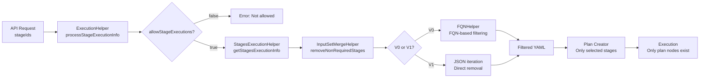

# Selective Stage Execution - Quick Reference

## Overview
Selective stage execution allows users to execute specific stages instead of the entire pipeline. Non-selected stages are **removed from YAML before plan creation**, so they never exist as plan nodes.

## Flow Summary

```
API Request → YAML Filtering → Plan Creation (filtered YAML) → Execution (only selected stages)
```

## API Endpoint

**Path**: `POST /api/pipelines/{identifier}/stages`

**Request**:
```java
RunStageRequestDTO {
  List<String> stageIdentifiers;        // ["deploy", "verify"]
  String runtimeInputYaml;              // Runtime inputs
  Map<String, String> expressionValues; // Expression values
}
```

**File**: `contracts/src/main/java/io/harness/pms/plan/execution/resources/PlanExecutionResource.java:278`

## Core Flow

### 1. Entry Point
**File**: `service/src/main/java/io/harness/pms/plan/execution/helper/PipelineExecutor.java:198`

```java
runStagesWithRuntimeInputYaml() → startPlanExecution(stagesToRun, ...)
```

### 2. Stage Processing
**File**: `service/src/main/java/io/harness/pms/plan/execution/helper/ExecutionHelper.java:1201`

```java
processStageExecutionInfo(stagesToRun, allowedStageExecution, ...) {
  // Validate: allowStageExecutions must be true
  // Validate: Not all stages deleted
  // Filter YAML to include only selected stages
  return StagesExecutionInfo {
    pipelineYamlToRun: <filtered>,  // Only selected stages
    fullPipelineYaml: <original>,   // All stages (for reference)
    stageIdentifiers: [...],
    isStagesExecution: true
  }
}
```

### 3. YAML Filtering
**File**: `884-pms-commons/src/main/java/io/harness/pms/merger/helpers/InputSetMergeHelper.java`

#### V0 (FQN-based):
```java
removeNonRequiredStages(yaml, stageIds) {
  fqnMap = generateFQNMap(yaml)
  fqnMap.remove(fqn where fqn.stageId ∉ stageIds)
  return generateYaml(fqnMap)
}
```

#### V1 (JSON-based):
```java
removeNonRequiredStagesV1(yaml, stageIds) {
  stages = yaml.pipeline.stages
  stages.removeIf(stage.id ∉ stageIds)
  // Handle parallel: unwrap if 1 stage, remove if 0
}
```

**File**: `953-yaml-commons/src/main/java/io/harness/pms/merger/fqn/helpers/FQNHelper.java:106`

### 4. Plan Creation
Plan creator receives **filtered YAML only**. Non-selected stages never become plan nodes.

### 5. Metadata Storage
**File**: `modules/orchestration-beans/contracts/src/main/java/io/harness/execution/StagesExecutionMetadata.java`

```java
StagesExecutionMetadata {
  boolean isStagesExecution;                      // true
  List<String> stageIdentifiers;                  // ["deploy", "verify"]
  Map<String, String> expressionValues;
  LinkedHashMap<String, String> stageIdentifierToNameMap;
}
```

Stored in `PlanExecution.stagesExecutionMetadata` in MongoDB.

## Key Classes

| Class | Location | Purpose |
|-------|----------|---------|
| `RunStageRequestDTO` | `contracts/.../dto/RunStageRequestDTO.java:24` | API request |
| `StagesExecutionInfo` | `service/.../beans/StagesExecutionInfo.java:24` | Processing metadata |
| `StagesExecutionMetadata` | `modules/orchestration-beans/.../StagesExecutionMetadata.java:23` | Persisted metadata |
| `StagesExecutionHelper` | `service/.../StagesExecutionHelper.java:29` | Filtering logic |
| `InputSetMergeHelper` | `884-pms-commons/.../InputSetMergeHelper.java:39` | YAML manipulation |
| `FQNHelper` | `953-yaml-commons/.../FQNHelper.java:106` | V0 filtering |
| `StageExecutionSelectorHelper` | `contracts/.../StageExecutionSelectorHelper.java:35` | Stage info extraction |

## Edge Cases

### Parallel Stages
```yaml
parallel:
  - stage: build_us     # selected
  - stage: build_eu     # selected
  - stage: build_asia   # NOT selected
```
**Result**: Parallel block kept with 2 stages

**Single selection**: Unwraps from parallel
**Zero selection**: Removes entire parallel block

### Stage Dependencies (useFromStage)
- System **detects** dependencies but **does NOT auto-include** them
- Missing dependency → Runtime expression resolution failure
- User must manually select all required stages

**File**: `contracts/.../StageExecutionSelectorHelper.java:195` (dependency detection)

### allowStageExecutions Setting
```yaml
pipeline:
  allowStageExecutions: false  # Must be true for selective execution
```
**Validation**: `ExecutionHelper.java:1212` throws `InvalidRequestException` if false

### All Stages Deleted
If all requested stages deleted from pipeline → `InvalidRequestException`

**Validation**: `StagesExecutionHelper.java:30-49`

## Mermaid Flow



## Key Differences

| Feature | Selective Stage Execution | Conditional Execution | Skip Conditions |
|---------|---------------------------|----------------------|-----------------|
| When applied | Before plan creation | Runtime evaluation | Runtime evaluation |
| Plan nodes created | Only selected stages | All stages | All stages |
| YAML modification | Yes (filtered) | No | No |
| Expression type | N/A | `when: <+condition>` | `skipCondition: <+condition>` |

## Critical Files Reference

```
API Layer:
  contracts/src/main/java/io/harness/pms/plan/execution/resources/PlanExecutionResource.java:278

Execution Flow:
  service/src/main/java/io/harness/pms/plan/execution/helper/PipelineExecutor.java:198
  service/src/main/java/io/harness/pms/plan/execution/helper/ExecutionHelper.java:1201

Filtering:
  service/src/main/java/io/harness/pms/plan/execution/StagesExecutionHelper.java:51
  884-pms-commons/src/main/java/io/harness/pms/merger/helpers/InputSetMergeHelper.java:161
  953-yaml-commons/src/main/java/io/harness/pms/merger/fqn/helpers/FQNHelper.java:106

Stage Info:
  contracts/src/main/java/io/harness/pms/stages/StageExecutionSelectorHelper.java:77
```

## Quick Lookup

**How to find where stages are filtered?**
→ `InputSetMergeHelper.removeNonRequiredStages` (line 161)

**How to find dependency detection?**
→ `StageExecutionSelectorHelper.getNonExpressionReferences` (line 209)

**How to find validation logic?**
→ `StagesExecutionHelper.throwErrorIfAllStagesAreDeleted` (line 30)

**How to find metadata storage?**
→ `PlanExecutionMetadata.stagesExecutionMetadata` field

**How to find API endpoint?**
→ `PlanExecutionResource.runStagesWithRuntimeInputYaml` (line 291)
